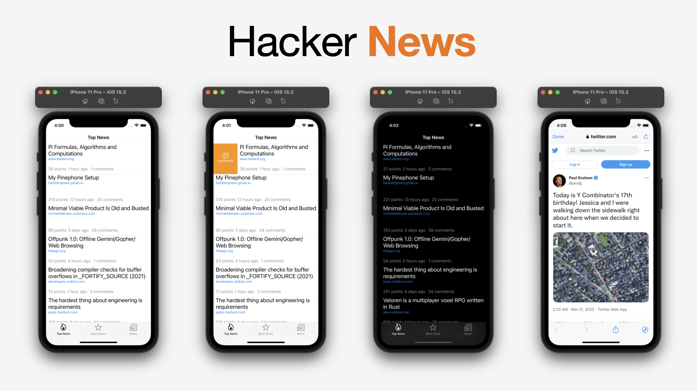

# Hacker News

Hacker News app is a small application based on UIKit and MVVM architecture.

This app is created from;
- MVVM architecure.
- Autolayout without storyboard.
- SFSafariViewController.

## API

[Hacker News API](https://github.com/HackerNews/API) Documentation and Samples for the Official HN API

